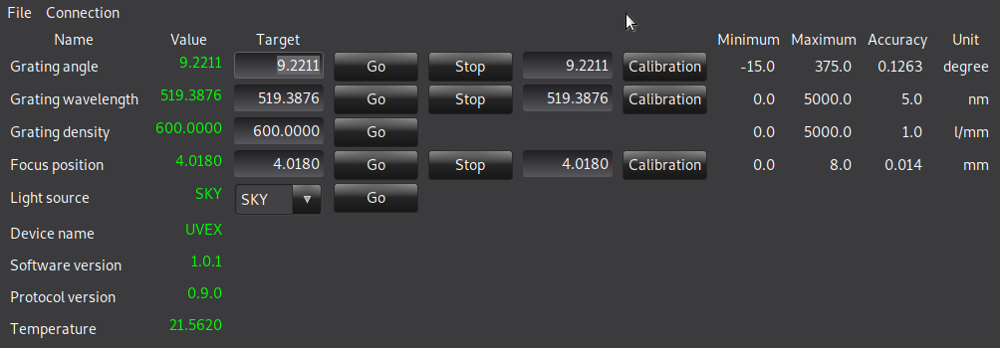

# Wx-Usis

This Python software aims in driving an USIS-compliant spectroscope. So far, only the UVEX supports this protocol, so it has only been tested against this model.
It relies on the WX graphics library ( https://wxpython.org/ ), which provides a cross-platform GUI toolkit.
For accessing the device, this application uses the USIS protocol, as described in the https://github.com/Shelyak-Instruments/USIS-Protocol/blob/main/USIS-specification.md document.

## Supported OS and Python
| OS            | Python                      | Notes                                                                                      |
| ------------- | -------------               | ---------                                                                                  |
| Windows 10    | 3.7 (Anaconda environment)  | Should work on Windows 11, as Anaconda isolates the Python code from the OS inner layers. |
| Linux         | 3.7                         | Tested on Debian 11 and Ubuntu 20.04, but should work on Fedora/RedHat flavors as well.     |

## Installation
It is highly recommended to run this code into a Python virtual environment, either with anaconda/miniconda (https://anaconda.org/) or with the Python virtualenv toolkit.
Then install the **wxpython** and the **pyserial** packages. This is it.

#### Notes
Some more recent Python version (3.8+) should also work as long as the wxpython package exists for this version. As of today, this is not the case for some Linux-based environments.

## Usage
Using this GUI is pretty straightforward.

1. Connect the UVEX to a serial port (directly if the computer hosts a RS-232 socket, or through an USB converter).
2. Run the application.
3. Using the connection menu, select the serial port. Wait one or two seconds as the software is retrieving all necessary information from the device.
4. When the GUI is displayed, you may change some values using the GO button, or set some motor positions with the CALIBRATE button.
5. You may exit at any time, as all values are stored inside the device.

